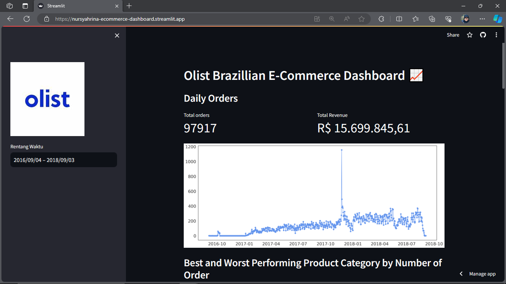

# Olist Brazillian E-Commerce Dashboard :chart_with_upwards_trend:

## Setup environment
```
conda create --name main-ds python=3.9
conda activate main-ds
pip install numpy pandas scipy matplotlib seaborn jupyter streamlit babel
```

## Run steamlit app
```
streamlit run dashboard.py
```

## Description:

Welcome to the Olist Brazilian E-Commerce Data Dashboard project repository! This project was created as the final project of the Dicoding learning module "Belajar Analisis Data dengan Python" (Learn Data Analysis with Python). It showcases a comprehensive data dashboard that provides insights into the Olist e-commerce dataset, along with a detailed notebook for data cleaning and exploratory data analysis (EDA).

## Project Overview:

- Dashboard: Explore the dynamic and interactive dashboard powered by Streamlit, allowing you to visualize key metrics and trends in the Olist e-commerce dataset. The dashboard is publicly available and can be accessed online at [Olist E-Commerce Dashboard](https://nursyahrina-ecommerce-dashboard.streamlit.app/). Discover valuable insights into the e-commerce data, including sales performance, product categories, customer demographics, and more.

- Notebook: Dive deep into the data preprocessing and exploratory data analysis (EDA) process with the Jupyter notebook provided. Follow along as we clean the dataset, extract meaningful information, and uncover hidden patterns and trends. This notebook is a valuable resource for those interested in understanding the data analysis process.

## Key Features:

Visualize customer demographics and their geographical distribution.
Analyze the performance of different product categories.
Investigate sales trends and seasonality in Olist's e-commerce data.

## Access the Dashboard:



The Olist Brazilian E-Commerce Data Dashboard is hosted on the Streamlit Community Cloud and can be accessed at [https://nursyahrina-ecommerce-dashboard.streamlit.app/](https://nursyahrina-ecommerce-dashboard.streamlit.app/). Explore the world of Brazilian e-commerce data and gain insights into this dynamic market.


### Data Analysis Project: E-Commerce Public Dataset (Olist)
- Name: Nursyahrina
- Email: nursyahrina17@gmail.com
- Dicoding ID: nursyahrina
